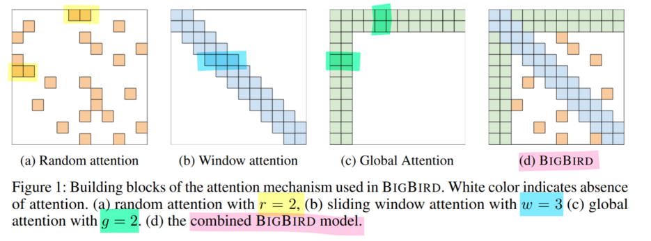

# artificial_big_bird_matrix_generator

## About
This project is part of my internship at CSLAB. The goal is to provide some Python / C code to generate sparse matrices that have the same look as BigBird. 

BigBird is a sparse-attention based transformer which extends Transformer based models, such as BERT to much longer sequences. Moreover, BigBird comes along with a theoretical understanding of the capabilities of a complete transformer that the sparse model can handle.

This is what my work is based on:

The `artificial_big_bird_matrix_generator` generates matrices like BigBird (d).

## The repository

- `benchmark_speed_up.txt` : A comparison of `big_bird.c` vs `big_bird_parallel.c`.
- `big_bird.c` : The generator, first written in Python/Numpy, then ported to C.
- `big_bird.html` : HTML version of the Jupyter notebook.
- `big_bird.ipynb` : Jupyter notebook (main file).
- `big_bird.pdf` : PDF version of the Jupyter notebook.
- `big_bird_parallel.c` : Parallel version of `big_bird.c` with OpenMP.
- `deps.py` : Side project that scans Python files to determine function dependencies for a specific function.
- `interactive_app.py` : An interactive app to visualize the generated matrices.
- `Makefile` : The Makefile.
- `optimal_width_for_a_given_sparsity.pdf` : LaTeX proof of one formula I used.
- `previous_work_paper_big_bird.pdf` : Paper about BigBird by Google.
- `README.md` : This file.
- `requirements.txt` : Python requirements.
- `*.png` : Image assets for the notebook and README.

